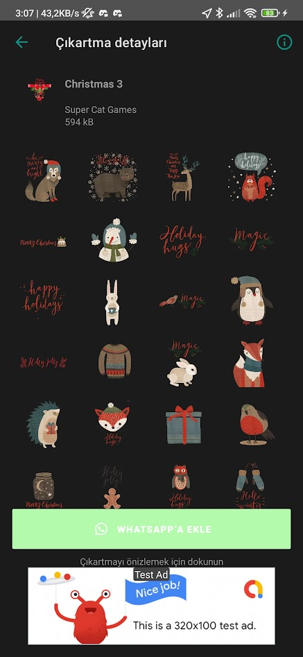

# 🎄 Christmas Sticker Pack for WhatsApp (Android)

## Project Overview

This Android project was developed as a student exercise focused on the complete lifecycle of a mobile application. The primary goal was to gain practical experience with **third-party app integration (WhatsApp)**, **Google Play Store publishing**, and basic **monetization** via ad integration.

## Skills Demonstrated

* **Android Development:** Practical experience with Android Studio, utilizing ContentProviders, and managing Intent-based communication for external app integration.
* **Asset Optimization:** Optimized all graphic assets (PNG to **WebP** conversion) to comply with WhatsApp's strict file size and quality requirements (under 100KB per sticker).
* **App Distribution & Policies:** Managed the entire release process on the Google Play Console, learning about store listing requirements and distribution pipelines.
* **Basic Monetization:** Successfully integrated a basic ad solution (e.g., AdMob) and demonstrated initial revenue generation.
* **Version Control:** Project source code managed using Git.

## Status

The application was successfully published to the Google Play Store, serving its purpose as a complete end-to-end student development project. The app is currently retired and no longer active on the store due to the project's conclusion and changes in platform policies. The repository contains the full source code for review.

---

## 📸 Screenshots

Here are some screenshots from the application, demonstrating its features and integration:

### Sticker Pack List

*This screen displays all available Christmas sticker packs within the application.*

### Christmas 3 Pack Details

*A detailed view of the "Christmas 3" sticker pack, showing individual stickers and the option to add them to WhatsApp.*

### Christmas 2 Pack Details

*Another detailed view, this time for the "Christmas 2" pack, showcasing its sticker collection.*